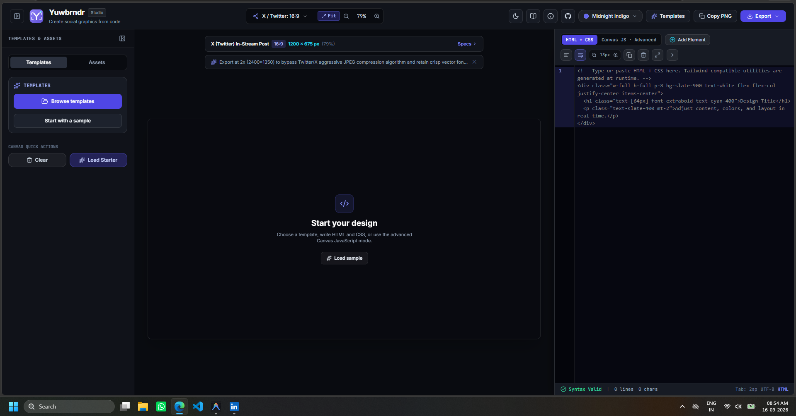

<p align="center">
  <a href="https://techaaroorian.github.io/yuwbrndr/">
    
  </a>
</p>

<h1 align="center">Yuwbrndr</h1>

<p align="center">
  <strong>Design by Code · Design to All</strong><br />
  An open-source, browser-native studio for turning HTML, Tailwind CSS, and Rough.js into high-resolution social graphics and multi-slide LinkedIn carousels.
</p>

<p align="center">
  <a href="https://techaaroorian.github.io/yuwbrndr/"></a>
  <a href="LICENSE"></a>
  
  <a href="CONTRIBUTING.md"></a>
</p>

---

<p align="center">
  
</p>

## Why Yuwbrndr?

Every developer who posts technical tutorials, system designs, or architecture diagrams on LinkedIn and X faces the same headaches with traditional tools and AI image generators:

1. **AI Hallucinations & Unfixable Typos**: When an AI generator misspells a word or scrambles an API route, you can't just edit the text—you have to re-roll the entire prompt slot machine. With Yuwbrndr, you edit the string in CodeMirror and the canvas updates in **16 milliseconds**.
2. **Moving Beyond the "Typical AI Slop" Look**: Built-in [Rough.js](https://roughjs.com/) integration lets you create organic, hand-drawn whiteboard diagrams with sketchy hatched fills that feel human and authentic.
3. **Multi-Slide Carousels in 1 Click**: Social platforms like LinkedIn reward multi-slide document carousels with 2.5x higher engagement. Yuwbrndr lets you design up to 6 structured slides and export them directly to a **multi-page high-DPI PDF** or a ZIP of numbered PNGs.
4. **Zero-Server URL Sharing**: When you click "Share", your entire design (code, aspect ratio, theme) is compressed client-side into the URL hash using native `CompressionStream` (`#share=v1z...`). No database, no accounts, and no data tracking.
5. **No Token Limits or Quotas**: Runs 100% in your browser. Generate as many graphics as you want without subscription paywalls or credit meters.

---

## Key Features

- **🎨 Dual Engine**: Live HTML/CSS with Tailwind-compatible utilities (UnoCSS Wind4) or sandboxed 2D Canvas JavaScript.
- **✏️ Hand-Drawn Whiteboard Art (Rough.js)**: Declarative `<svg data-rough-rect="...">` attributes or inline scripts with open-source fonts like Comic Neue, Caveat, and Patrick Hand.
- **📄 Multi-Slide Carousel Generator**: Dedicated slide deck strip supporting up to 6 slides with instant **Export PDF** (for LinkedIn carousels) and **Export ZIP** (for X/Twitter threads).
- **📱 Mobile-First Typography**: Aspect ratio presets (LinkedIn 1200×627, X/Twitter 1200×675, Instagram 1080×1080) with built-in font size guardrails so diagrams stay sharp on mobile feeds.
- **⚡ Instant 1x / 2x / 4x Retina PNG Export**: High-DPI rasterization powered by `html-to-image` and clipboard copy.
- **🔍 Real-Time Syntax Linter**: Tag-balance validator and JavaScript syntax checker built right into CodeMirror 6.
- **🌗 Responsive Dark & Light Studio**: Comfortable workspace on desktop, tablet, and mobile.

---

## Quick Start (Local Development)

### Prerequisites
- **Node.js**: v20 or newer
- **npm**: v9 or newer

### Installation

```bash
# Clone the repository
git clone https://github.com/TechAaroorian/yuwbrndr.git
cd yuwbrndr

# Install dependencies
npm install

# Start local dev server
npm run dev
```

Open `http://localhost:5173/` in your browser.

---

## Testing & Quality Assurance

Yuwbrndr features an automated test suite powered by **Vitest**:

```bash
# Run Vitest unit tests
npm test

# Run code linter
npm run lint

# Build production bundle
npm run build
```

---

## Security & Sandbox Model

- HTML previews run inside an isolated iframe sandbox (`sandbox="allow-scripts allow-same-origin"`).
- Canvas JavaScript executes within an isolated Function runner with restricted scopes.
- Uploaded assets remain stored in browser client RAM and are **never** uploaded to an external server.

---

## Contributing

Contributions make the open-source community an amazing place to learn, inspire, and create! Any contributions you make are **greatly appreciated**.

Please check out our [**Contributing Guidelines (CONTRIBUTING.md)**](CONTRIBUTING.md) to get started with adding templates, improving components, or submitting PRs.

---

## License

Distributed under the **MIT License**. See [`LICENSE`](LICENSE) for more information.

Built with ❤️ by [**Janarthanan Soundararajan (@TechAaroorian)**](https://github.com/TechAaroorian).
